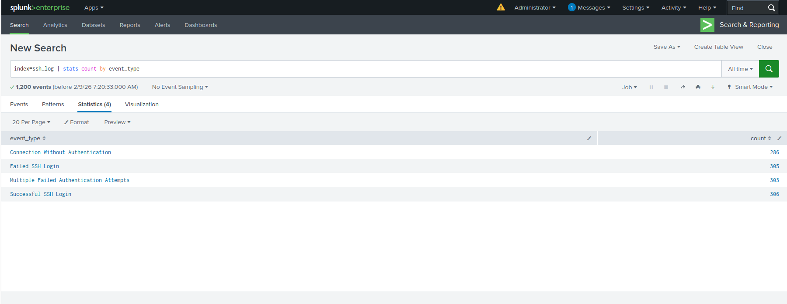
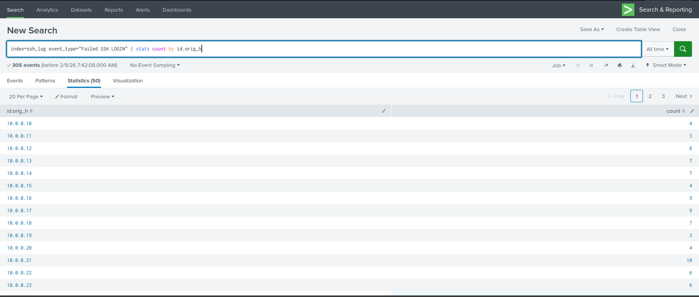
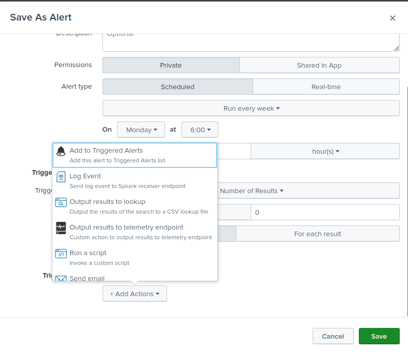
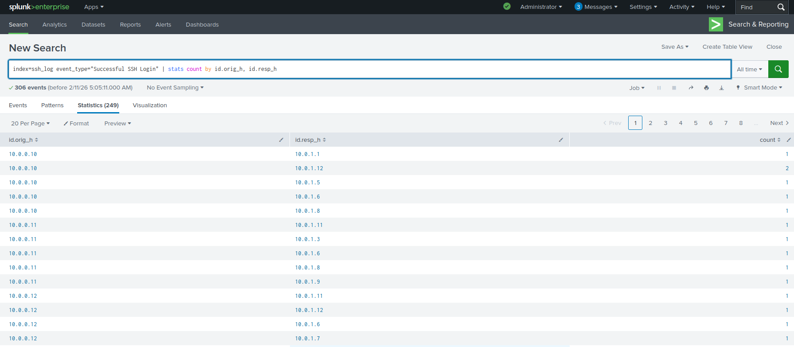
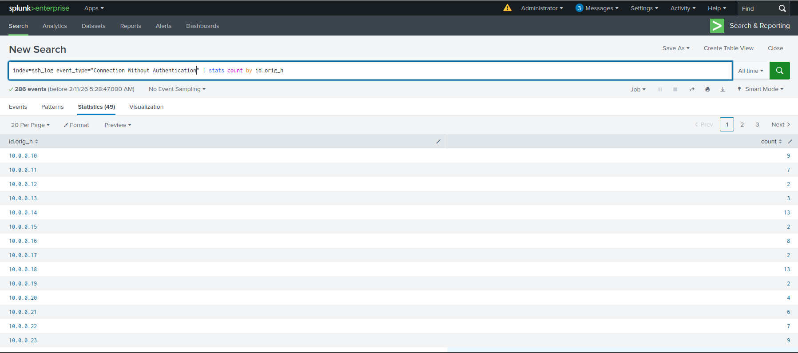

# SSH-Log-Analysis-Splunk
SOC Analyst project analyzing SSH authentication logs using Splunk to detect brute-force attacks, failed logins, successful access, and suspicious connections.

# SSH Log Analysis Using Splunk

## Project Overview
This project demonstrates the analysis of SSH authentication logs using Splunk to identify suspicious activity and potential security threats. The workflow reflects real-world SOC Analyst responsibilities including log ingestion, parsing, analysis, visualization, and alerting.

---

## Objective
The objective of this project is to detect and analyze:

- Successful SSH login attempts
- Failed SSH authentication attempts
- Multiple failed authentication attempts indicating brute-force attacks
- SSH connections without authentication indicating scanning or probing activity

---

## Lab Setup and Prerequisites
- Splunk Enterprise or Free Edition
- SSH log file (`ssh_log.json`)
- Completed Splunk installation and basic configuration

## Step-by-Step Guide
### Task 1: Ingest and Parse Logs
Upload ssh_log.json into Splunk.
Ensure the following fields are extracted correctly:
event_type (Successful SSH Login, Failed SSH Login, Multiple Failed Authentication Attempts, Connection Without Authentication)
auth_success (true/false/null)
auth_attempts
id.orig_h (source IP)
id.resp_h (destination host)
Run a validation search:
index=ssh_log | stats count by event_type

### Task 2: Analyze Failed Login Attempts
Identify all failed login attempts:

index=ssh_logs event_type="Failed SSH Login"
| stats count by id.orig_h
Highlight the top 10 source IPs generating failed logins.

Create a bar chart visualization for failed login attempts per source IP.

### Task 3: Detect Multiple Failed Authentication Attempts (Brute Force)
Search for multiple failed attempts in logs:

index=ssh_logs event_type="Multiple Failed Authentication Attempts"
| stats count by id.orig_h, id.resp_h
Detect repeated failures (e.g., more than 5 attempts).

Configure a Splunk alert:

### Task 4: Track Successful Logins
Search for successful logins:

index=ssh_logs event_type="Successful SSH Login"
| stats count by id.orig_h, id.resp_h
Compare successful logins against prior failed attempts (to detect compromised accounts).

Create a dashboard panel showing top source IPs for successful logins.

### Task 5: Spot Suspicious Connections Without Authentication
Search for unauthenticated SSH connections:

index=ssh_logs event_type="Connection Without Authentication"
| stats count by id.orig_h
Create a timechart visualization to monitor such events over time:

index=ssh_logs event_type="Connection Without Authentication"
| timechart count by id.orig_h
Identify repeated unauthenticated attempts — potential indicators of port scanning or SSH probing.
- index=ssh_log | stats count by event_type
  

